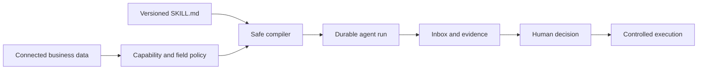

Mandala is an approval-centered workspace for running permissioned AI workflows over connected business data.

It combines versioned agent definitions, connector capabilities, deterministic policy, durable runs, human review, and controlled execution. The model can interpret evidence and propose work; it cannot invent permissions, approve itself, or access connector credentials.

## How Mandala works

1. **Connect data.** A connector exposes versioned read, propose, or execute capabilities.
2. **Define an agent.** A `SKILL.md` declares the workflow, rules, evidence, records, approvals, and allowed actions.
3. **Compile safely.** Mandala checks the definition against the selected workspace's grants, field policy, connector health, and current schemas.
4. **Run durably.** The runtime reads only bound data, checkpoints progress, applies deterministic rules, and creates a reviewable work item.
5. **Review and act.** A person inspects the recommendation, evidence, warnings, and exact draft before deciding. Execution is a separate, rechecked step.

## Product surfaces

- **Terminal client:** the primary guided experience for work review, agent management, Sandbox, workspace selection, and read-only questions.
- **Web application:** authentication, browser authorization, workspace services, settings, records, and supporting product surfaces.
- **Control plane:** tenant-aware APIs and shared contracts for work items, decisions, execution, agents, Context Engine, and audit history.
- **Runtime:** a generic compiler and graph engine. New workflows do not need a workflow-specific API route or privileged code path.

## Safety by intersection

An operation is available only when every required boundary agrees:

- the installed skill requests the capability;
- an installed connector offers the exact version and access level;
- the workspace grants it;
- field-level model policy permits the needed data;
- connector health and schema compatibility pass;
- the acting user's role allows the operation; and
- the current approval and execution policy are still valid.

If any part is missing or stale, Mandala fails closed.

## What is implemented today

The current repository includes:

- hosted and local CLI authentication with workspace selection;
- agent validation, installation, testing, activation, pause, resume, disable, version history, and rollback;
- a real-data Sandbox with bounded catalog mappings and a mock write boundary;
- an approval Inbox with evidence, editable drafts, warning acknowledgement, rework, and read-only questions;
- immutable capability bindings and policy rechecks at execution time;
- durable LangGraph checkpoints and idempotent execution receipts;
- connector sync adapters for ShipHero and Trello plus a synthetic commerce connector;
- a governed Context Engine with optional Supermemory indexing, bounded retrieval, provenance, and citations;
- company roles, invitations, account services, usage records, monitoring, feedback, and memory controls; and
- example procurement-reorder and sales-spike agents.

<Note>
  The state-changing executors included in the repository are mock-only. The architecture models additional modes, but the current product does not silently perform live vendor or ERP writes.
</Note>

## Start here

- Follow the [Quickstart](/quickstart) to run the complete local flow.
- Learn how definitions compile in [Agents](/guides/agents).
- Understand the write boundary in [Sandbox](/guides/sandbox).
- Review the human workflow in [Inbox and approvals](/guides/inbox-and-approvals).
- See all terminal commands in the [CLI reference](/reference/cli).
- Use [Architecture](/system/architecture) for the engineering map.