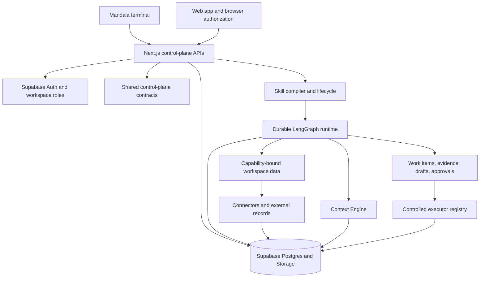

Mandala is a Turborepo with a Next.js control plane, a cross-platform terminal client, shared TypeScript contracts, Supabase persistence, and background workers for connectors, context, signals, monitoring, email, and account cleanup.

## Repository map

| Area | Responsibility |
| --- | --- |
| `apps/cli` | Interactive TUI, scripted commands, hosted and local auth, secure local session storage |
| `apps/web/app/api/mandala` | Authenticated workspace, agent, Sandbox, control, review, execution, memory, and usage APIs |
| `apps/web/lib/mandala` | Compiler, runtime, connectors, Context Engine, policies, lifecycle, actions, and services |
| `packages/control-plane` | Shared request, response, authorization, context, Sandbox, and workspace-data contracts |
| `skills` | Installable example `SKILL.md` definitions |
| `supabase/migrations` | Tenant, workflow, connector, capability, context, audit, and account schemas |
| `supabase/tests` | Authorization and database behavior tests |
| `seed` | Local workspace, connector, policy, fixture, and catalog setup |

## Request boundary

The CLI and web app do not talk directly to provider credentials or privileged database tables. They call authenticated Next.js route handlers.

Each route:

1. validates the session or managed CLI credential;
2. checks that the selected workspace is bound to that session;
3. validates the body with shared Zod schemas;
4. authorizes the exact company permission;
5. calls a domain service or database RPC; and
6. returns a bounded response envelope.

The terminal renders safe projections rather than arbitrary raw database rows.

## Agent boundary

The compiler turns a declarative skill into a manifest with exact capability bindings and a fixed graph. Activated versions and mapping snapshots are immutable.

At runtime, allowed tools come from the compiled graph node. Model judgment is limited to the bounded evidence and approved fields supplied to that node. Deterministic rules calculate protected values and decide whether work is ready, warned, suppressed, or blocked.

LangGraph checkpoints preserve progress through retries and human approval pauses. Hosted deployments use `MANDALA_WORKFLOW_DATABASE_URL`; local development reuses the local Supabase Postgres database.

## Data boundary

Connectors normalize provider records into tenant-scoped external records. A workspace data catalog describes datasets and schema fingerprints. Skills bind business capabilities to catalog datasets through versioned mapping snapshots.

The Context Engine maintains a separate derived index of policy-approved operational memory. It never replaces the authoritative connector snapshot or the evidence stored with a work item.

## Execution boundary

Approval creates or releases a short-lived execution capability for the exact draft and review version. Execution rechecks lifecycle, policy, binding, connector health, actor role, approval, and idempotency before dispatch.

Adapters cannot receive connector credentials through the model or client. The registry validates input and output, applies timeout and retry policy, stores hashed receipts, and records whether an effect was simulated, observed, committed, unknown, or requires reconciliation.

The repository's registered state-changing adapter currently supports mock execution only.

## Background work

Internal worker routes process:

- connector synchronization;
- Context Engine indexing and reconciliation;
- changed-record signal dispatch;
- follow-up monitoring;
- email delivery and payload resolution; and
- account-deletion cleanup.

Workers use secret-protected internal routes, database leases, bounded batches, idempotency, and durable event records. A browser request is not required to keep these pipelines moving.